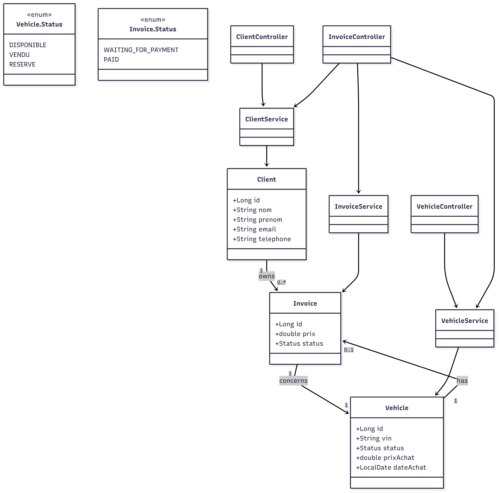

# Springboot

## 🧾 Présentation du projet

Ce projet est une API REST développée avec **Spring Boot** pour la gestion d’un **parc automobile de vente**.  
Elle permet de gérer trois entités principales :

- **Client** : représente une personne acheteuse, pouvant être liée à plusieurs factures.
- **Vehicle** : représente un véhicule du parc, associé à **une seule facture** s’il a été vendu.
- **Invoice** : représente une **facture de vente**, liée à **un client** (acheteur) et **un véhicule** (vendu).

### 🔗 Relations entre entités

- Un **Client** peut avoir **plusieurs factures** (`1 - n`).
- Une **Invoice** est liée à **un seul Client** et **un seul Vehicle** (`n - 1`).
- Un **Vehicle** peut être associé à **une seule Invoice** ou **aucune** (`0 - 1`).

## 🔄 Cycle de vie et transitions des statuts

Le projet gère deux types de statuts métiers via des énumérations (`enum`) : ceux des **véhicules** et des **factures**.  
Ces statuts reflètent l’état réel du véhicule ou de la facture dans le processus de vente.

---

### 🚗 Vehicle.Status — Statut d’un véhicule

| Statut         | Description                                 |
|----------------|---------------------------------------------|
| `DISPONIBLE`   | Le véhicule est disponible à la vente.      |
| `RESERVE`      | Le véhicule est réservé par un client.      |
| `VENDU`        | Le véhicule a été vendu (liens avec facture).|

#### 🔁 Transitions possibles :

- `DISPONIBLE` → `RESERVE` : lorsqu’un client manifeste un intérêt sérieux.
- `RESERVE` → `VENDU` : si la vente est confirmée via une **facture payé**.

---

### 🧾 Invoice.Status — Statut d’une facture

| Statut                | Description                             |
|-----------------------|-----------------------------------------|
| `WAITING_FOR_PAYMENT` | Facture émise mais non encore payée.    |
| `PAID`                | Facture réglée, vente finalisée.        |

#### 🔁 Transitions possibles :

- Création d'une facture : statut initial = `WAITING_FOR_PAYMENT`.
- `WAITING_FOR_PAYMENT` → `PAID` : une fois le paiement reçu.

> Une facture `PAID` est considérée comme **finalisée** : le véhicule lié passe en `VENDU`.

---

### 🔗 Règles de cohérence entre `Vehicle` et `Invoice`

- Une facture de statut `PAID` entraîne automatiquement le passage du véhicule lié à `VENDU`.
- Un véhicule `VENDU` ne peut être lié à **aucune autre facture**.
- La suppression d'une facture ne remet pas le véhicule en `DISPONIBLE`.

## 📘 Diagramme de classes

## 🛣️ API Roadmap

| Méthode | Endpoint                  | Description                                 | Corps / Params              |
|---------|---------------------------|---------------------------------------------|-----------------------------|
| **GET** | `/api/clients`           | Liste tous les clients                      | —                           |
| **GET** | `/api/clients/{id}`      | Récupère un client par ID                   | `id: Long`                  |
| **POST**| `/api/clients`           | Crée un nouveau client                      | `ClientDto`                 |
| **PUT** | `/api/clients/{id}`      | Met à jour un client                        | `id: Long`, `ClientDto`     |

| Méthode | Endpoint                  | Description                                 | Corps / Params              |
|---------|---------------------------|---------------------------------------------|-----------------------------|
| **DELETE**| `/api/clients/{id}`    | Supprime un client                          | `id: Long`                  |
| **GET** | `/vehicles`              | Liste tous les véhicules                    | —                           |
| **GET** | `/vehicles/id/{id}`      | Récupère un véhicule par ID                 | `id: Long`                  |
| **GET** | `/vehicles/vin/{vin}`    | Récupère un véhicule par VIN                | `vin: String`               |
| **POST**| `/vehicles`              | Crée un nouveau véhicule                    | `VehicleDto`                |
| **PUT** | `/vehicles/{id}`         | Met à jour un véhicule                      | `id: Long`, `VehicleDto`    |
| **DELETE**| `/vehicles/{id}`       | Supprime un véhicule                        | `id: Long`                  |

| Méthode | Endpoint                  | Description                                 | Corps / Params              |
|---------|---------------------------|---------------------------------------------|-----------------------------|
| **GET** | `/invoices`              | Liste toutes les factures                   | —                           |
| **GET** | `/invoices/{id}`         | Récupère une facture par ID                 | `id: Long`                  |
| **GET** | `/invoices/by-price-desc`| Liste les factures les plus chères          | —                           |
| **POST**| `/invoices`              | Crée une nouvelle facture                   | `InvoiceDto`                |
| **PUT** | `/invoices/{id}`         | Met à jour une facture                      | `id: Long`, `InvoiceDto`    |
| **DELETE**| `/invoices/{id}`       | Supprime une facture                        | `id: Long`                  |

### 🔍 Documentation interactive

➡️ [Swagger UI](http://localhost:8080/swagger-ui/index.html)

